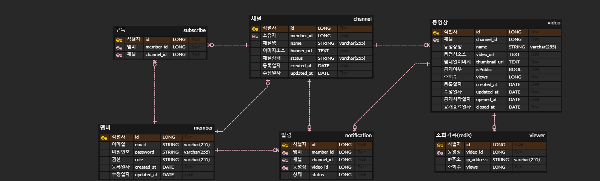

# VOD 서비스

동영상을 등록하고 다른 사람이 등록한 영상을 볼 수 있는 VOD 서비스입니다.

## Setting
- Java 17
- Project : Gradle - Groovy
- Spring Boot 3.2.4

### Tech Stack

 
   
   
   
  
  
  
  

## 프로젝트 기능
- 회원가입
  - 회원가입시 이메일과 패스워드를 입력받으며, 이미 가입된 이메일은 중복 가입이 불가능하다.
  - 모든 사용자는 회원가입시 USER 권한을 지닌다. 
  
- 로그인
  - 로그인시 회원가입때 사용한 이메일과 패스워드가 일치해야한다.
 
- 계정 권한 변경
  - ADMIN 권한을 가진 유저는 특정 계정에 관리자 권한 부여/삭제가 가능하다.

- 패스워드 변경
  - USER 권한을 가진 유저는 본인 계정의 패스워드 변경이 가능하다.
  - ADMIN 권한을 가진 유저는 모든 계정의 패스워드 변경이 가능하다.
 
- 계정 삭제
  - USER 권한을 가진 유저는 본인 계정에 대하여 삭제가 가능하다.
  - ADMIN 권한을 가진 유저는 모든 계정에 대하여 삭제가 가능하다.
  - 계정 삭제 시 해당 계정의 채널 삭제 처리

- 채널 등록
  - 동영상 등록을 할 수 있는 채널을 생성한다.
  - 모든 유저는 1개의 채널을 생성할 수 있다.

- 채널 정보 조회
  - 로그인 하지 않은 유저도 채널의 정보(이름, 채널 소유자, 배너 이미지, 영상 목록)등을 조회할 수 있다.

- 채널 정보 변경
  - USER 권한을 가진 유저는 본인의 채널에 대하여 정보 변경이 가능하다.
  - ADMIN 권한을 가진 유저는 모든 채널에 대하여 정보 변경이 가능하다.

- 채널 삭제
  - USER 권한을 가진 유저는 본인의 채널에 대하여 삭제가 가능하다.
  - ADMIN 권한을 가진 유저는 모든 채널에 대하여 삭제가 가능하다.
  - 계정 삭제 시 해당 계정의 채널 삭제 처리

- 채널 정지
  - ADMIN 권한을 가진 유저는 모든 채널에 대하여 정지가 가능하다.
  - 채널 정지 시 해당 채널 내 모든 동영상 조회, 시청, 등록 불가
 
 - 채널 정지 해제
  - ADMIN 권한을 가진 유저는 정지된 채널에 대하여 정지 해제가 가능하다.

- 채널 구독
  - 로그인한 유저는 채널 구독이 가능하다.
  - 구독중인 채널에 새 동영상이 등록되면 알람이 발생한다.
 
- 동영상 검색
  - 로그인 하지 않은 유저도 현재 서비스에 등록되어있는 동영상 검색이 가능하다.
 
- 동영상 시청
  - 로그인 하지 않은 유저도 현재 서비스에 등록되어있는 동영상 시청이 가능하다.
  - 조회수 집계는 IP기준으로 이루어진다.
 
- 동영상 등록
  - 자신의 채널에 동영상 등록이 가능하다.
  - 동영상 등록 시 썸네일 이미지를 설정하면 설정한 이미지가, 썸네일 이미지가 별도로 설정되지 않으면 자동 추출하여 썸네일 이미지로 사용한다.
 
- 동영상 정보 변경
  - USER 권한을 가진 유저는 본인이 등록한 동영상에 대하여 정보 변경이 가능하다.
  - ADMIN 권한을 가진 유저는 모든 동영상에 대하여 정보 변경이 가능하다.
  - 동영상 소스 변경은 불가능하다.
 
- 동영상 삭제
  - USER 권한을 가진 유저는 본인이 등록한 동영상에 대하여 삭제가 가능하다.
  - ADMIN 권한을 가진 유저는 모든 동영상에 대하여 삭제가 가능하다.
 
## 추가 구현 목표 기능
- 소셜 로그인/회원가입
- 라이브 스트리밍 송출
- 라이브 스트리밍 채팅(웹소켓)
- 동영상 댓글/대댓글

## ERD 

## Trouble Shooting
[go to the trouble shooting section](doc/TROUBLE_SHOOTING.md)

